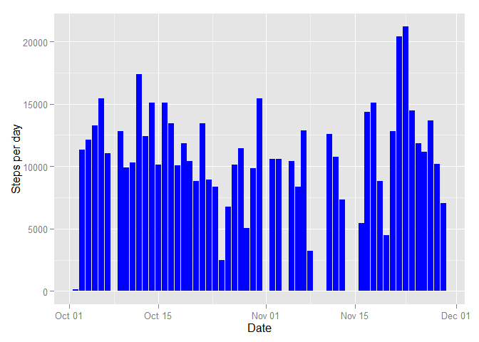
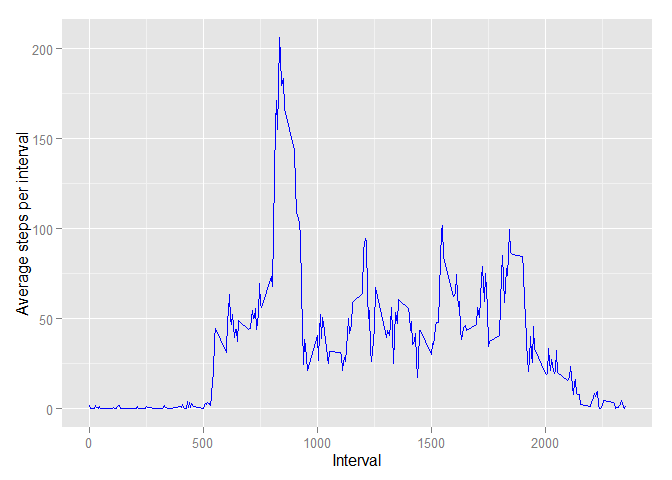
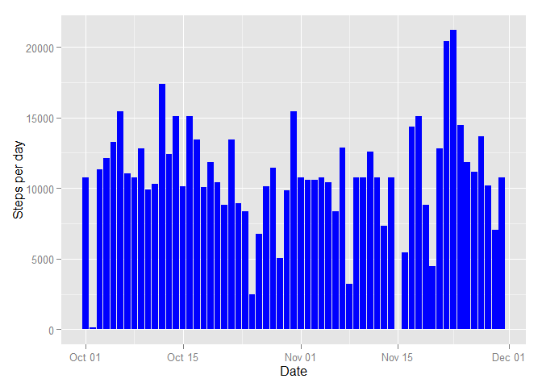
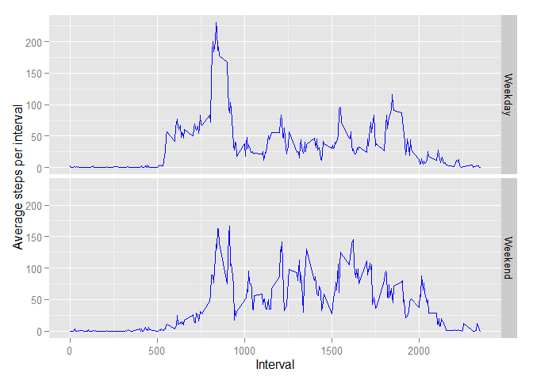

# Reproducible Research: Peer Assessment 1

## Loading and preprocessing the data

```r
#Load the ggplot2 library and set defaults for knitr
library(ggplot2)
```

```
## Warning: package 'ggplot2' was built under R version 3.2.2
```

```r
library(data.table)
```

```
## Warning: package 'data.table' was built under R version 3.2.2
```

```r
knitr::opts_chunk$set(tidy=FALSE, fig.path="figures/")

#Check if our data file exists and unzip if needed. Then read it into a data frame.
if(!file.exists("data/activity.csv")){
  unzip("activity.zip", exdir="data")
}
base_data <- read.csv("data/activity.csv", na.strings="NA")

# Get the number of steps per day (disregard NAs)
stepsPerDay <- aggregate(formula=steps~date, data=base_data, FUN=sum, na.rm=TRUE)
# Make the date column a type Date
stepsPerDay$date <- as.Date(stepsPerDay$date)
```

## What is mean total number of steps taken per day?
Make a histogram of the total number of steps per day

```r
ggplot(data=stepsPerDay) + geom_histogram(aes(x=date, y=steps), fill="blue", stat="identity") + labs(y='Steps per day', x='Date')
```

 

Mean and median of the number of steps per day

```r
mean(stepsPerDay$steps)
```

```
## [1] 10766.19
```

```r
median(stepsPerDay$steps)
```

```
## [1] 10765
```

## What is the average daily activity pattern?

```r
stepsPerInterval <- aggregate(steps ~ interval, data=base_data, FUN=mean)
ggplot(data=stepsPerInterval) + geom_line(aes(x=interval, y=steps), colour="blue", stat="identity") + labs(y='Average steps per interval', x='Interval')
```

 

Which 5-minute interval contains the maximum number of steps over all the days?

```r
stepsPerInterval$interval[which.max(stepsPerInterval$steps)]
```

```
## [1] 835
```

## Imputing missing values
What is the total number of missing values in the dataset?

```r
sum(is.na(base_data))
```

```
## [1] 2304
```

Use the mean value of each of the 5-minute intervals top impute the missing values for the intervals.

```r
# Create a new clean dataset with a placeholder column for data from our stepsPerInterval set
cleaned_base_data <- merge(base_data, stepsPerInterval, by="interval", suffixes=c("", ".filled"))
base_data_steps_na <- is.na(cleaned_base_data$steps)
# Fill the NA values in the steps column with the data from the placeholder column
cleaned_base_data$steps[base_data_steps_na] <- cleaned_base_data$steps.filled[base_data_steps_na]
# Drop the placeholder column and convert date column to Date format
cleaned_base_data <- cleaned_base_data[, c(1:3)]
cleaned_base_data$date <- as.Date(cleaned_base_data$date)

# Calculate the steps per day again
cleanedStepsPerDay <- aggregate(steps~date, data=cleaned_base_data, FUN=sum)
```

Make a histogram of the total number of steps per day from the new dataset

```r
ggplot(data=cleanedStepsPerDay) + geom_histogram(aes(x=date, y=steps), fill="blue", stat="identity") + labs(y='Steps per day', x='Date')
```

 

Mean and median of the number of steps per day

```r
mean(cleanedStepsPerDay$steps)
```

```
## [1] 10766.19
```

```r
median(cleanedStepsPerDay$steps)
```

```
## [1] 10766.19
```

The mean and median of the new dataset is now the same, and the same as the mean from the original
dataset. This leads me to believe that the impact on the analysis of the missing data in the original dataset is low.

## Are there differences in activity patterns between weekdays and weekends?
I'll be using the cleaned data ste for the next part of the analysis.


```r
# Classify dates as Weekday or Weekend
cleaned_base_data$isWeekend <- factor(ifelse(weekdays(cleaned_base_data$date) %in% c("Saturday", "Sunday"), "Weekend", "Weekday"))

# Calculate the steps per interval per weekday/weekend on the clean data
stepsPerDayclassPerInterval <- as.data.frame(data.table(cleaned_base_data)[, list(steps=mean(steps)), by=list(interval, isWeekend)])

ggplot(data=stepsPerDayclassPerInterval) + geom_line(aes(x=interval, y=steps), colour="blue", stat="identity") + facet_grid(isWeekend~.) + labs(y='Average steps per interval', x='Interval')
```

 
